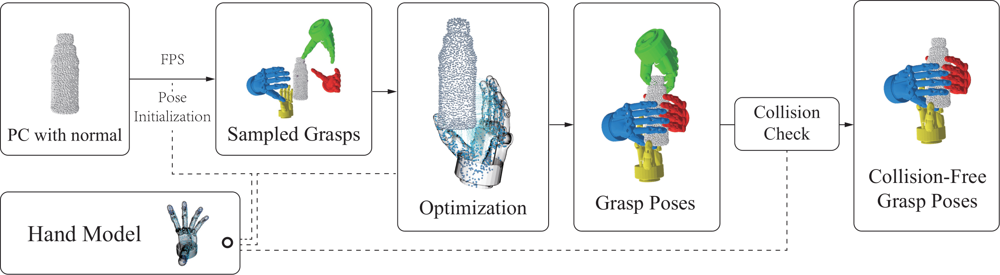

# DiPGrasp: Parallel Local Searching for Efficient Differentiable Grasp Planning
[**Paper**](https://arxiv.org/pdf/2408.04738.pdf) | [**Project Page**](https://dipgrasp.robotflow.ai/) <br>

<div style="text-align: center">

</div>

This repository contains the implementation of the paper:

**DiPGrasp: Parallel Local Searching for Efficient Differentiable Grasp Planning**  
Wenqiang Xu*, Jieyi Zhang*, Tutian Tang, Zhenjun Yu, Yutong Li, Cewu Lu (* = Equal contribution)  
**IEEE Robotics and Automation Letters**

## Installation

The code could run on both Linux and Windows system. 

### Set up the environments with conda and pip

Install [anaconda](https://www.anaconda.com/) or [miniconda](https://docs.conda.io/en/latest/miniconda.html). Supposing that the name `dipgrasp` is used for conda environment:

```shell
conda create -n dipgrasp python=3.10
conda activate dipgrasp
```

Then, install dependencies with `pip install`

```shell
pip install -r requirements.txt --no-deps
```

### Download the essential components
We upload the objects mentioned in paper and some essential components on https://huggingface.co/datasets/robotflow/DipGrasp  
You can follow the instructions to download the assets.
After downloading, you should move the `assets` directory to the project main directory:
```shell
mv path/to/assets .
```

## Generate the grasp pose for one object
You can run the following command to generate the grasp pose:
```
python main.py
```
We use Schunk SVH hand as our default gripper. You could see the object and the gripper with generated pose after it generate each batch of pose.

The output pose will be saved at `output` directory, consisting of two numpy files `pose.npy` and `joint_state.npy`. The `pose.npy` contains a numpy array with shape `(N, 4, 4)`,
while the `joint_state.npy` contains a numpy array with shape `(N, D)`, where `N` is the number of generated poses and the `D` is the DoF of the gripper.

To generate the pose with other grippers, you could use the following command:
```
python main.py gripper=shadow
```
where the `shadow` could be repleced by `svh` or `barrett`.

To get the subtle and stable pose where the gripper contacts with the object surface, we use the [RFUniverse](https://github.com/robotflow-initiative/rfuniverse) as the simulator to refine the generated poses.
You can use the following command to get the refined poses:
```
python main.py datafile=assets/object/class/drink/drink9/drink9.obj simulator=True visualize_setting.visualize=False visualize_setting.visualize_after_simulator=True
```
You may notice that we change the target object file, because the simulator needs a mesh file rather than pointcloud.


## Generate the grasp pose for a batch of object
To generate a large number of poses on different objects, we provide a [script file](scripts/generate_for_batch_obj.py), you can run the following command to generate the poses:


```
python scripts/generate_for_batch_obj.py 
```

The poses saved have passed through the simulator by default.
You could also alter the gripper type by adding `gripper` parameter.
The number of generated poses will be logged into `results.log`.

You could generate grasp poses on your own objects by modifying the script.
The simulator only supports object with .obj format.
## Adapting to Custom Hand Models
If you're interested in applying our algorithm to your custom hand model, you can easily do so by following these steps:

1. **Generate the Point Cloud XML File:**
   - First, obtain the palmar side point cloud XML file. We've provided a point cloud generator as discussed in Section IV.D of our paper. You can find this tool in the `assets/xml_generator` directory. For detailed instructions, check out [this document](media/XMLGeneratorTutorial.md).

2. **Organize Your Files:**
   - Place the generated XML file alongside your hand URDF file and any related description files within the `assets/gripper` directory. Ensure they follow the same format as the hand models we currently support.

3. **Update Configuration Files:**
   - Add a new gripper configuration file to the `conf/gripper` directory, similar to the existing gripper configuration files.

4. **Modify the Main Script:**
   - Include the name of your new hand model in the list within [main.py](./main.py) at line 113.

5. **Adjust Initial Position Settings:**
   - Ensure that the hand is oriented correctly towards the object in its initial position. You can tweak the `init_sample_config` function in [config.py](core/config.py) and look at the `correct_coordinate` function in [samplePosition.py](core/geometry/samplePosition.py) for guidance.

By following these steps, you'll be able to integrate your custom hand model into our system.
## Citation
If you find our code or paper useful, please consider citing
```bibtex
@article{dipgrasp,
      title = {DiPGrasp: Parallel Local Searching for Efficient Differentiable Grasp Planning},
      author = {Xu, Wenqiang and Zhang, Jieyi and Tang, Tutian and Yu, Zhenjun and Li, Yutong and Lu, Cewu},
      journal = {IEEE Robotics and Automation Letters},
      year = {2024},
      publisher = {IEEE},
    }
}

```