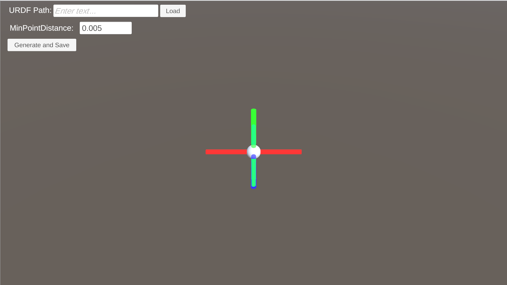
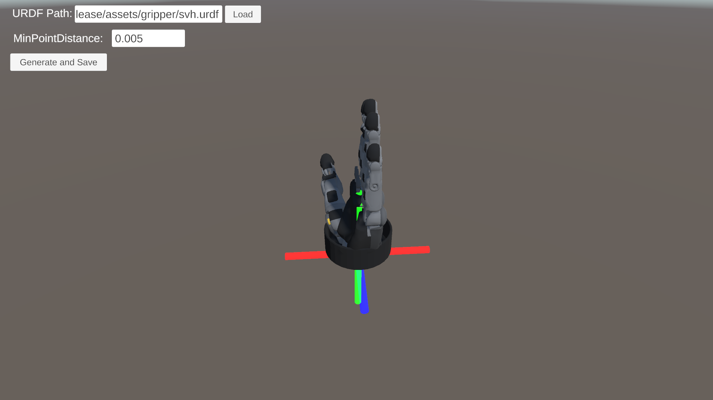
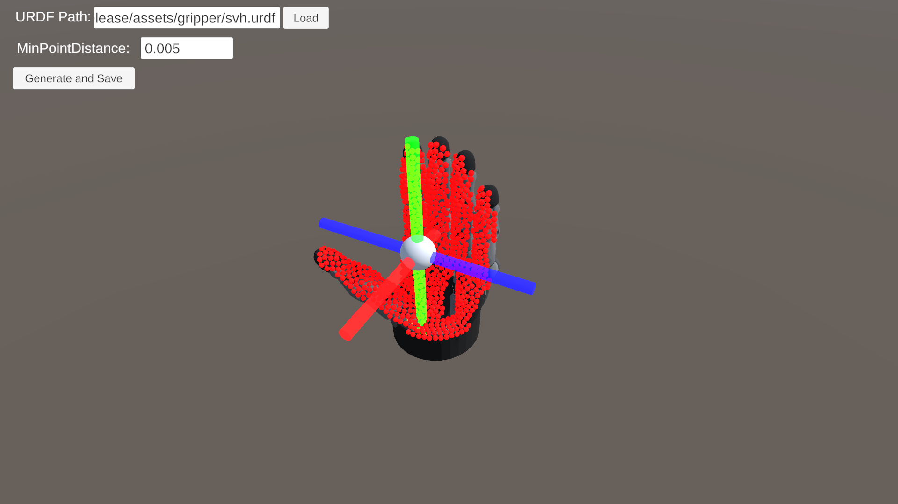

# The guidance of palmar side point cloud generator
Here’s a quick guide on how to use the palmar side pointcloud XML file generator. We have versions available for both Linux and Windows.

1. **Starting the Program**:
   - Run the executable file (`PointCloud.x86_64` for Linux or `PointCloud.exe` for Windows). You’ll see a window that looks like this:
   
     

     
     

   
   - Enter the absolute path of your hand URDF file in the text box in the upper left corner and click the *Load* button. You'll then see the hand model appear in the scene:
   
     

     
     

2. **Generating the Pointcloud**:
   - Position the white ball at the center of the hand’s palm by dragging the axis.
   - Click the *Generate and Save* button. This will create a `PointCloud.xml` file in the directory where the executable is located:
   
     

     
     

### Additional Controls
- **Adjusting Settings**:
   - Adjust the *MinPointDistance* parameter to control the density of the points.

- **Navigating the View**:
   - Use the right mouse button and drag to adjust the camera direction.
   - Press the WASD keys to move the camera position.

Feel free to play around with these settings to get the best results for your needs!